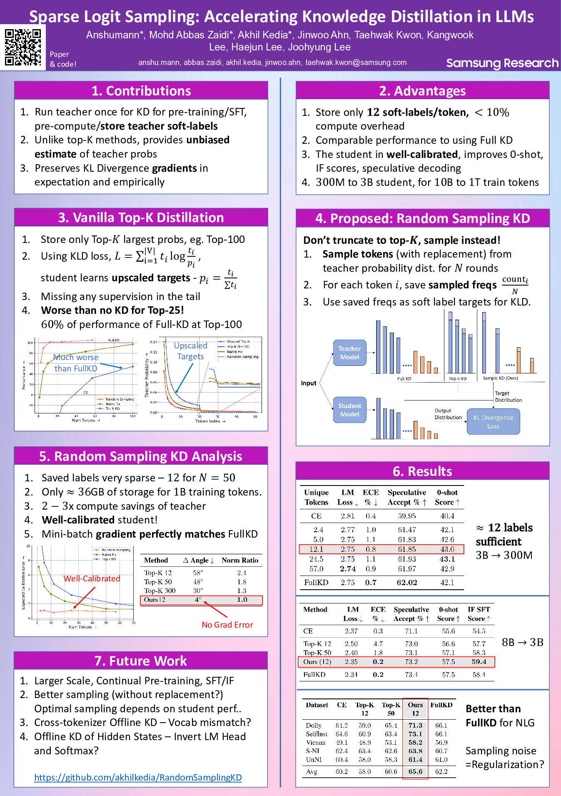

# Sparse Logit Sampling: Accelerating Knowledge Distillation in LLMs

🌟 [ArXiv Preprint](https://arxiv.org/abs/2503.16870) | [Published Version](https://aclanthology.org/2025.acl-long.885/) | [Poster](ACL_poster/Poster.pdf) | [Presentation Slides](ACL_poster/Presentation.pptx)

Cached Knowledge Distillation from LLM logits while only storing 12 sparse logits/token. **Accepted as an Oral paper at ACL 2025!**

Source code will be uploaded in the next couple of weeks after company approvals are completed!

## 🔗 Quick Links

- [Sparse Logit Sampling: Accelerating Knowledge Distillation in LLMs](#sparse-logit-sampling-accelerating-knowledge-distillation-in-llms)
  - [🔗 Quick Links](#-quick-links)
  - [Poster](#poster)
  - [Bugs or Questions?](#bugs-or-questions)
  - [Citation](#citation)

## Poster



## Bugs or Questions?

If you have any questions related to the code or the paper, feel free to email the authors (check paper for author emails). If you encounter any problems when using the code, you can open an issue!

## Citation

Please cite our paper if you find the repo helpful in your work:

```bibtex
@inproceedings{anshumann-etal-2025-sparse,
    title = "Sparse Logit Sampling: Accelerating Knowledge Distillation in {LLM}s",
    author = "Anshumann, Anshumann  and
      Zaidi, Mohd Abbas  and
      Kedia, Akhil  and
      Ahn, Jinwoo  and
      Kwon, Taehwak  and
      Lee, Kangwook  and
      Lee, Haejun  and
      Lee, Joohyung",
    editor = "Che, Wanxiang  and
      Nabende, Joyce  and
      Shutova, Ekaterina  and
      Pilehvar, Mohammad Taher",
    booktitle = "Proceedings of the 63rd Annual Meeting of the Association for Computational Linguistics (Volume 1: Long Papers)",
    month = jul,
    year = "2025",
    address = "Vienna, Austria",
    publisher = "Association for Computational Linguistics",
    url = "https://aclanthology.org/2025.acl-long.885/",
    pages = "18085--18108",
    ISBN = "979-8-89176-251-0",
}

```
